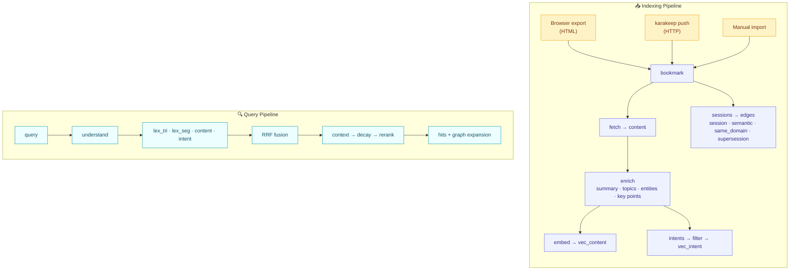

<p align="center">
  
</p>

<h1 align="center">🔖 facetmark</h1>

<h3 align="center">Find the page you can't quite name — search the memory, not just the title.</h3>

<p align="center">
  Meaning · exact words · the moment you saved it — converge in one private SQLite library.
</p>

<p align="center">
  <b>English</b> · <a href="README.zh-CN.md">简体中文</a> ·
  <a href="#-quickstart"><b>🚀 Quickstart</b></a> ·
  <a href="#-installation"><b>📦 Install</b></a> ·
  <a href="#-configuration"><b>🔧 Config</b></a> ·
  <a href="#-what-is-actually-measured"><b>📊 Results</b></a> ·
  <a href="#-use-it-as-karakeeps-search-engine"><b>🔗 karakeep</b></a> ·
  <a href="#-contributing"><b>🤝 Contributing</b></a>
</p>

<p align="center">
  <a href="https://github.com/88lin/facetmark/actions/workflows/ci.yml"></a>
  <a href="https://pypi.org/project/facetmark/"></a>
  <br>
  <a href="https://www.python.org/"></a>
  <a href="LICENSE"></a>
  <a href="tests/"></a>
</p>

> [!NOTE]
> Everything runs on your machine against a single SQLite file. Nothing is uploaded,
> nothing is deleted, and your browser's own bookmark store is **never** written to.

---

## 🎯 The Problem

You saved a page eight months ago. You remember *why* you saved it — *"that thing about
Postgres index types someone linked in a thread"* — and you remember roughly when. What you
do **not** remember is its title, and the title is the only thing your browser's bookmark
search looks at.

facetmark builds **four different indexes** over each bookmark:

| Facet | What it is | What it answers |
|---|---|---|
| **Lexical** 🔤 | Two FTS5 indexes: character trigrams + word segments | Exact strings, IDs, code, Chinese without spaces |
| **Content** 📝 | An embedding of the page's actual extracted text | *"That article about consumer group rebalancing"* |
| **Intent** 💭 | LLM-generated queries you *might* have used, filtered by whether they retrieve the page back | *"How do I stop Kafka from stalling?"* |
| **Context** 🗂️ | Save-session clustering, domain and graph structure | *"The batch I saved while debugging that outage"* |

…fuses them with **reciprocal rank fusion**, and then — this is the unusual part —
**measures whether each of those four facets was worth adding**, publishes the numbers, and
turns off the ones that lost. Several of them lost. The [📊 What Is Actually
Measured](#-what-is-actually-measured) section is the honest list.

---

## ⚙️ How It Works



> [!NOTE]
> Every stage is **idempotent** and **fingerprinted**: `facetmark index` re-runs only what
> changed. The fingerprint for enrichment is the body hash; for embeddings it is the
> reconstructed embed text, so a vector that exists but was built from stale text is still
> detected.

---

## 🚀 Quickstart

```bash
pip install facetmark            # or: uv pip install facetmark

facetmark init                                  # create the database
facetmark import bookmarks.html                 # Chrome/Firefox/Edge/Safari export
facetmark index                                 # fetch → enrich → embed → sessions → edges
facetmark search "那个讲 Postgres 索引类型的"     # or use the web UI
facetmark serve                                 # then open http://127.0.0.1:8787/app
```

<details>
<summary>📤 How to export bookmarks from each browser</summary>

| Browser | Steps |
|---|---|
| **Chrome / Edge** | `chrome://bookmarks` → ⋮ → Export |
| **Firefox** | Manage Bookmarks → Import and Backup → Export to HTML |
| **Safari** | File → Export → Bookmarks |

</details>

### 🎮 No API key? No library? Try the demo

```bash
facetmark demo
```

> [!TIP]
> Builds a small synthetic library with a deterministic mock provider, indexes it, and runs
> a handful of queries. **No network, no key, no cost** — the fastest way to see the shape
> of the output and verify your install works.

### Other entry points

```bash
facetmark import-json bookmarks.json    # Firefox JSON backup, or any {url,title,...} list
```

Or push from karakeep — see [🔗 Use It as karakeep's Search Engine](#-use-it-as-karakeeps-search-engine).

---

## 📦 Installation

**From PyPI:**

```bash
pip install facetmark
```

**From source:**

```bash
git clone https://github.com/88lin/facetmark
cd facetmark
python -m venv .venv && . .venv/bin/activate
pip install -e ".[dev]"
pytest -q               # 1524 tests, ~41 s
ruff check src tests scripts
```

> [!NOTE]
> Requires **Python 3.10+**. The only heavy optional dependency is
> `sentence-transformers`, needed solely for the local embedding backend.

---

## 🤖 Model Access

facetmark talks to **any OpenAI-compatible endpoint**. Two things are needed: a **chat
model** (for enrichment and intent generation) and an **embedding model**.

```bash
export FACETMARK_API_KEY=sk-...
export FACETMARK_BASE_URL=https://api.openai.com/v1     # must include /v1
export FACETMARK_CHAT_MODEL=gpt-4o-mini
export FACETMARK_EMBED_MODEL=text-embedding-3-small
export FACETMARK_EMBED_DIM=1536
```

> [!TIP]
> Works unchanged against **Azure OpenAI**, **together.ai**, **DeepSeek**, **SiliconFlow**,
> **Ollama** (`http://localhost:11434/v1`), **vLLM**, **LM Studio**, or an internal gateway.

### Local embeddings

Some gateways proxy chat but not embeddings. Switch the embedding half to a local model and
leave the chat half on the endpoint:

```bash
pip install "facetmark[local]"
export FACETMARK_EMBED_BACKEND=local
export FACETMARK_EMBED_MODEL=bge-m3
export FACETMARK_EMBED_DIM=1024
export FACETMARK_LOCAL_EMBED_PATH=/path/to/bge-m3     # or leave unset to download
export FACETMARK_LOCAL_EMBED_MAX_SEQ=1024
```

`facetmark selfcheck-embed` verifies the backend before you spend an hour indexing: it
embeds a fixed 64-document probe set twice and reports self-cosine and best-mismatch cosine.
On bge-m3 at 1024 tokens the measured minimum self-cosine is **0.999976** and all 64
documents match themselves; at a 512-token budget the minimum drops to 0.9769, which is why
1024 is the default and why the check exists.

> [!WARNING]
> **Changing `FACETMARK_EMBED_DIM` invalidates every stored vector.** facetmark refuses to
> mix dimensions rather than silently returning nonsense; re-index with `--force`.

---

## 🔧 Configuration

Every setting is an environment variable prefixed `FACETMARK_`, a key in a `.env` beside the
working directory, or a key in `<DATA_DIR>/config.toml`. That is also the precedence order,
highest first — a file the web UI wrote never overrides a variable you exported. The web UI's
Settings panel edits the file; `facetmark config path` prints it.

`DATA_DIR` defaults per OS: `%LOCALAPPDATA%\facetmark` on Windows,
`$XDG_DATA_HOME/facetmark` when that is set, otherwise `~/.local/share/facetmark`.

| Variable | Default | What it does |
|---|---|---|
| `DATA_DIR` | per OS, above | Where the database and caches live |
| `DB_NAME` | `facetmark.db` | Database filename inside `DATA_DIR` |
| `API_KEY` | — | Key for the OpenAI-compatible endpoint |
| `BASE_URL` | `https://api.openai.com/v1` | Endpoint root; **must** include `/v1` |
| `CHAT_MODEL` | `gpt-4o-mini` | Enrichment and intent generation |
| `EMBED_MODEL` | `text-embedding-3-small` | Embeddings |
| `EMBED_DIM` | `1536` | Vector width; changing it invalidates the store |
| `EMBED_BACKEND` | `endpoint` | `endpoint` or `local` |
| `LOCAL_EMBED_PATH` | — | Path to a local sentence-transformers model |
| `LOCAL_EMBED_MAX_SEQ` | `1024` | Token budget per document |
| `LOCAL_EMBED_BATCH` | `8` | Local batch size |
| `REQUEST_TIMEOUT` | `60.0` | Per-request timeout, seconds |
| `FETCH_CONCURRENCY` | `30` | Parallel page fetches |
| `MIN_BODY_CHARS` | `200` | Below this, a page counts as body-less |
| `BODY_TRUNCATE_CHARS` | `6000` | Body kept for enrichment |
| `ENRICH_CONCURRENCY` | `4` | Parallel enrichment calls |
| `INTENT_GENERATE_N` | `8` | Candidate intents per page |
| `INTENT_KEEP_N` | `4` | Intents kept after the retrieve-back filter |
| `RRF_K` | `60` | Reciprocal rank fusion constant |
| `CANDIDATES_PER_FACET` | `50` | Candidate depth per facet — a *floor*, see [Paging](#-paging) |
| `MAX_PAGE_SIZE` | `200` | Largest page any surface will serve; bigger requests are clamped, not rejected |
| `MAX_CANDIDATE_DEPTH` | `2000` | Hard ceiling on candidate depth |
| `RERANK_DEPTH` | `20` | How many hits the cross-encoder actually reorders |
| `GRAPH_EXPAND_HOPS` | `1` | Expansion radius |
| `GRAPH_EXPAND_FACTOR` | `0.6` | Score carried across an edge |
| `DECAY_FACTOR` | `0.5` | Multiplier applied to cold results |
| `DECAY_AGE_DAYS` | `365` | Age condition for the cold layer |
| `DECAY_RESCUE_THRESHOLD` | `0.02` | Below this the demotion is lifted — see [What Is Actually Measured](#-what-is-actually-measured) |
| `HOST` / `PORT` | `127.0.0.1` / `8787` | Server bind address |

---

## 📋 Commands

| Command | What it does |
|---|---|
| `facetmark init` | Create the database |
| `facetmark import FILE.html` | Import a browser bookmark export |
| `facetmark import-json FILE.json` | Import Firefox JSON or a generic list |
| `facetmark index` | Run every stage, skipping what has not changed |
| `facetmark fetch` / `enrich` / `embed` / `intents` / `sessions` / `edges` | Run one stage |
| `facetmark search QUERY` | Search from the terminal |
| `facetmark serve` | Web UI + REST API |
| `facetmark health` | Re-check saved URLs, record `gone` / `drifted` verdicts |
| `facetmark stats` | Row counts per table, coverage per stage |
| `facetmark demo` | Synthetic library, mock provider, no network |
| `facetmark selfcheck-embed` | Verify the embedding backend before indexing |
| `facetmark eval` | Run a query set against one or more configurations |
| `facetmark export` | Dump the library back out as JSON |

> [!TIP]
> Add `--force` to any stage to ignore fingerprints and redo the work.

---

## 🔍 Search Configurations

`facetmark search --config NAME` and the `config` field on the search API both accept these.
They exist because **each one was a hypothesis that got measured**.

| Name | Facets | Extras | Note |
|---|---|---|---|
| `A` | content | — | **The winner on the W1 query set.** |
| `B` | content, lex_seg, lex_tri | — | Adding lexical facets lost 5.4 pp |
| `C` | all four | — | |
| `D` | all four | context, graph | |
| `E` | all four | context, graph, rerank | |
| `full` | content | graph, decay | Shipped default when an API key is set |
| `fused` | all four | context, graph, rerank, decay | Shipped default under the mock provider |

Plus roughly twenty exploratory ablations (`A_ctx`, `A_gatedctx`, `C_notri`, `C_lowlex`,
`C_abstain`, `C_max`, `D_gated`, `lex_only`, `seg_only`, `tri_only`, …) used by the
experiments below. `facetmark eval --list-configs` prints them all.

---

## 📄 Paging

Every search surface takes `limit`, `offset` and `depth`, and every search response reports
the window it served:

```jsonc
{
  "hits": [ /* ... */ ],
  "limit": 20,          // what was served, after clamping — not an echo of the request
  "offset": 20,
  "depth": 60,          // the candidate depth this ranking was produced at
  "total": 137,         // documents ranked; a lower bound when depth_capped
  "has_more": true,
  "depth_capped": false // we stopped at the depth ceiling, not at the end of the library
}
```

```bash
facetmark search "kafka rebalance" -n 20                    # first page
facetmark search "kafka rebalance" -n 20 -o 20 --depth 60   # the next one
```

The CLI prints the `--offset` / `--depth` for the next page whenever there is one.

<details>
<summary>📖 Why <code>depth</code> is a parameter and not an implementation detail</summary>

Page size and retrieval depth used to be the same number: asking for more rows quietly
retrieved deeper, and result 51 was unreachable at any page size because the pool was 50
rows regardless. Now the page is a window onto a pool whose size you can see and pin.

Pinning matters because **RRF is only rank-stable under a growing pool when there is one
facet**. A document's score is a sum over the facets that ranked it *within the depth asked
for*, so a deeper pool can hand a document a term it did not have — and that term can
outweigh a rival's entire score. Rank 2 in one facet plus rank 40 in another beats a sole
rank 1 (1/62 + 1/100 against 1/61), but contributes nothing at depth 30. So with several
facets in play, growing the depth to reach page 2 lets page 2 disagree with page 1 about
page 1.

The fix is not to grow it. Send back the `depth` the previous page reported and every page
is a slice of one ranking. Leave it out and the depth is derived from the window, which is
the cheap thing to do for the overwhelmingly common single-page request.

The shipped `full` configuration has one facet, so its paging is exact whether or not you
pin anything. `fused` — the default under the mock provider — has four, and does not.

</details>

<details>
<summary>⚙️ Ceilings and what changed</summary>

**Ceilings.** `MAX_PAGE_SIZE` bounds a page and `MAX_CANDIDATE_DEPTH` bounds the pool. Both
clamp rather than reject, because a caller that asks for 10,000 rows wants results, not a
422 — and the response tells it what it actually got, so it can stop paging. When the pool
was cut by the ceiling rather than by the library running out, `depth_capped` says so, which
is the difference between "press next" and "narrow the query".

`CANDIDATES_PER_FACET` is now a floor rather than the pool size: every request retrieves at
least that much, so a five-row page still reports an honest `total`.

**What this does and does not change about relevance.** The fusion ranking a query produces
at a given depth is the ranking it produced before — no weight, no constant and no default
configuration moved. What changed is that the depth is visible, addressable and no longer a
side effect of the page size.

Two behaviours did move, both deliberately:

- **Reranking** is now bounded by `RERANK_DEPTH` (20), which is what `rerank.DEFAULT_DEPTH`
  always said and what the pipeline was overriding with "however many hits there are". The
  LLM reranker is listwise — one chat call carrying a line per candidate and returning a
  score per candidate — so an unbounded page grows both the prompt and the output, and past
  some page size the "score every id" contract stops fitting in the context window at all.
  On the configurations that rerank (`E`, `fused`), a page longer than 20 now leaves its
  tail in fused order.
- **The first-paint depth** (`quick_search`) is now at least `CANDIDATES_PER_FACET` rather
  than `3 × limit`, so a small first page is retrieved from the same pool as a large one
  instead of a shallower one.

Neither has been measured for retrieval quality, and nothing here is a claim that it
improves it.

</details>

---

## 📊 What Is Actually Measured

> [!IMPORTANT]
> Most of this section is **negative results**. That is deliberate: the point of publishing
> numbers is that they constrain what the project is allowed to claim.

### 📉 Fusion lost — and it lost to the simplest rung on the ladder

479 queries over a real 1,700-bookmark library ([`docs/eval-w1.md`](docs/eval-w1.md)):

| Config | Recall@5 | Recall@1 | MRR@10 | p50 latency |
|---|---|---|---|---|
| **A** — content vector only | **0.643** | **0.505** | **0.564** | **148 ms** |
| B — + two lexical facets | 0.589 | | | 189 ms |
| C — all four facets | 0.635 | | | 526 ms |
| D — + context + graph | 0.639 | | | 523 ms |

All three pre-registered criteria **failed**. Adding facets did not help; it cost **5.4 pp**
and **3.5× latency**. By query type, config A: content-style 0.959, vague 0.706, episodic
0.279 — the episodic number is the one the intent and context facets were supposed to fix.

Two things did survive:

- **Graph expansion** as a *separate* result group: **+2.09 pp**, 10 wins / 0 losses,
  p = 0.0019, 9 ms.
- **The reranker** on Recall@1: **+4.80 pp**, CI95 [+1.46, +8.35], 45 wins / 22 losses,
  p = 0.0067.

### 🚪 The context multiplier: one flag, two default reversals

On a fresh 616-query held-out set ([`docs/gate-w2w3.md`](docs/gate-w2w3.md)), gating the
context multiplier on an explicit time expression looked like the one clean win:
`A → A_gatedctx` = **+3.09 pp** [1.79, 4.55], 19 wins / 0 losses, p = 3.8e-6. It shipped.

Then a 361-query probe set built specifically to fire the gate
([`docs/gate-precision.md`](docs/gate-precision.md)) measured what happens *when it fires*:

| | Recall@5 | Recall@1 |
|---|---|---|
| A | 0.9058 | 0.801 |
| A_gatedctx | 0.7175 | 0.363 |

**−18.83 pp**, CI95 [−23.27, −14.68], 3 wins / 71 losses. Stratified: when the inferred
window does not contain the target (n=304) it costs −22.37 pp; when it does (n=57) it buys
exactly **+0.00 pp**. The gate never helps and frequently destroys. Verdict
`gate_precision_unqualified`, and the default was reverted to no gating.

A `gate_v2` was drafted and refused: it failed the same probe set at −10.52 pp even though it
passed the 616-query set at +1.79 pp. Two attempts, one mechanism, one direction of evidence
— the third attempt was declined rather than tuned into passing.

### 🔬 Five other candidate fixes, all measured

| Fix | Result | Link |
|---|---|---|
| **Lexical audit** | 80.1% of content-style and 46.3% of vague queries need no vector at all. But **6.05%** (29 of 479) are findable *only* lexically, above the pre-registered 5% line, so the lexical facets stay even though they lose in fusion. | — |
| **Fusion anatomy** | Flat-weight RRF is why: a coincidence on two weak facets (0.0279) outvotes confidence on one strong facet (0.0164). That is arithmetic, not tuning. | [`docs/w2-fusion-anatomy.md`](docs/w2-fusion-anatomy.md) |
| **Trigram on Chinese** | Only 25 of 211 Chinese queries (11.85%) got any trigram candidate. Fixed → 202 of 211 (95.73%). Overall Recall@5: **unchanged**. A facet can be broken and repaired and still not matter. | — |
| **Boost medium** | The context multiplier's `MAX_BOOST = 1.60` crosses 79.7% of the score range in config A but only 20.9% in C/D; equal displacement power would need 6.03. 66.3% of candidates get a multiplier of exactly 1.0. | [`docs/w3-criterion-medium.md`](docs/w3-criterion-medium.md) |
| **Intent facet** | Human read of 50 generated intents: 19/50 = 38% are queries a person would plausibly type, below the 50% line. The information word is absent from the page entirely 34.0% of the time overall — rising to **62.4%** on body-poor pages, which is exactly the population the facet was built for. | [`docs/w4-intent-strata.md`](docs/w4-intent-strata.md) |

The intent code is still there; what was rejected is treating it as a co-equal retrieval
facet.

### 🔄 The karakeep round-trip: `roundtrip_unfaithful`

2,376 real bookmarks pushed into a karakeep-shaped store and pulled back, 616 held-out
queries, pre-registered protocol frozen before the data moved
([`docs/karakeep-roundtrip-protocol.md`](docs/karakeep-roundtrip-protocol.md), full result
in [`docs/karakeep-roundtrip.md`](docs/karakeep-roundtrip.md)).

| | Criterion | Measured | |
|---|---|---|---|
| a | \|ΔRecall@5\| ≤ 3 pp, CI95 inside ±5 pp | **−0.81 pp**, CI95 [−2.44, +0.81] | ✅ pass |
| b | median overlap@5 ≥ 4 **and** top-1 agreement ≥ 80% | median 4.0; top-1 **79.06%** | ❌ **fail** |
| c | HTTP vs native read path identical, 616 × 2 configs | 0 mismatches | ✅ pass |

**Criterion b failed by 0.94 pp**, and the cause is fully attributed. Bodies round-trip
byte-identically (1876/1876). Summaries round-trip identically (2375/2375, 100%). But
`topics` match 0% and `entities` 1.18%, because karakeep's tags are the browser's *folder*
labels — a shelf, not a page. The keyword line inside the embedded text collapses from
**19,016 distinct terms to 13**, mean 10.32 → 0.76 per page, most common term `未分类`
("uncategorised") on 1,124 pages. Vectors then move by a median cosine of 0.9846, which is
enough to reshuffle the top of the list without changing aggregate recall.

Grafting the source enrichment back in makes **2376/2376** embed texts byte-identical with
zero residual, so the attribution is total. Running `facetmark index` on the bridged library
repairs it: 0 karakeep-supplied bodies are re-fetched, 2376/2376 bridge-written rows are
picked up by re-enrichment, and the rebuilt graph matches the source library exactly except
for 212 semantic edges (26,485 vs 26,697), which are precisely the edges built from the
drifted vectors.

> [!NOTE]
> **For anyone reading this repo's numbers:** metric-level conclusions transfer to a
> karakeep-enriched library; rank-level ones do not, until that library has been re-indexed
> with facetmark's own enrichment.

### ❄️ The decay layer cannot fire in the default profile — and that turns out to help

Found while explaining the round-trip result. RRF scores are `sum_f w_f / (k + rank_f)`;
with `rrf_k = 60` a single unit-weight facet tops out at `1/61 = 0.016393`.
`decay_rescue_threshold` ships at `0.02`. The default profile `full` is a **one-facet**
config, so `hot_top_score < rescue_threshold` is always true, the rescue valve always opens,
and the demotion it guards has never executed. `fused` is unaffected (two facets already
reach 0.0279). Pinned by `tests/test_decay_reach.py`.

That is a proof about arithmetic. It says nothing about consequence, so the consequence was
measured — **twice, and the second run overturned the first.**

<details>
<summary>🔬 Round one — measured an instrument that was never switched on</summary>

**Round one** ([`docs/decay-reach.md`](docs/decay-reach.md)) reported ΔRecall@5 = exactly
`0.0000 pp`, CI95 `[0, 0]`, with only 8 of 2,376 pages cold and 0 of 230 targets cold, and
concluded the defect costs nothing.

**Round one measured an instrument that was never switched on.** Its own §7 admitted health
check coverage had not been quantified. It had not: the library's `health` table held **zero
rows**, so the half of cold-layer condition 3 that depends on a health verdict could never
fire. `open_count` is also 0 for all 2,376 rows — browser bookmark exports carry no usage
telemetry — so condition 1 selects everything. What was actually running was condition 2
plus supersession edges, which is where the 8 came from.

</details>

<details>
<summary>🔬 Round two — the real measurement, and it overturned round one</summary>

**Round two** ([`docs/decay-instrumented.md`](docs/decay-instrumented.md)) ran one local-only
health pass over the same bytes (`save_recovered=False`, so only the `health` table changed —
verified by deep fingerprint on `content`, `edge`, `bookmark`, vectors and FTS) and repeated
the identical A/B:

| | shipped `0.02` | reachable `0.0` |
|---|---|---|
| Recall@5 | **0.5860** | **0.5714** |
| Recall@1 | 0.4237 | 0.4188 |
| queries where the valve opened | 417 / 616 | 0 / 616 |

| | Round one | Round two |
|---|---|---|
| `health` rows | 0 | 2,376 |
| cold pages | 8 (0.34%) | **73 (3.07%)** |
| cold ∩ 230 targets | **0** | **8** (19 queries) |
| ΔRecall@5 | `+0.0000 pp` `[0, 0]` | **`−1.4610 pp`** `[−2.5974, −0.4870]` |

**Fixing the threshold would cost 1.46 pp of Recall@5**, interval clear of zero. The
mechanism is countable, no statistics required: of 37 target-rank changes, **12 targets fell
out of the 20-item list — 10 of them from inside the top 5, 5 of them from rank 1** — while
24 rose (21 by a single place) and only **1** crossed into the top 5. Net `−10 + 1 = −9`
over 616 queries is exactly `−1.4610 pp`. Gains land inside recall buckets; losses land on
bucket boundaries.

</details>

> [!CAUTION]
> **Root cause: condition 3 treats "the URL is dead" as "the saved copy is worthless".**
> facetmark stores body text. The words on a 404 page are still the right answer to the
> question. `drifted` is worse — it means the remote copy no longer matches the local one,
> which is precisely when the local snapshot is the only surviving record.
>
> The threshold still stays, but the reason is now the **opposite** of round one's: not "the
> payoff is zero" but **"one bug is cancelling another, and the cancellation is
> load-bearing"**. Narrowing condition 3 needs a *new* query set — the two obvious candidate
> fixes were derived from these 616 queries' failures, so scoring them on the same 616 would
> be reporting a training score. And neither is clean: 4 of the 8 damaged targets have
> `char_count = 0`, no body text at all, yet are still retrieved and still correct via title
> and the lexical facets.

`cold_census()` now reports the three conditions separately and names both silent failures
(`never_opened_selects_everything`, `health_never_checked`) in `fm stats` and
`fm health --check`, so the next such gap does not need to be found by hand.

### ✅ One real export, end to end

`favorites_2026_8_4.html`, 1.7 MB, 96 folders, 4 levels deep: parsed 1,710 → inserted
1,701, 9 duplicates merged, 1 non-indexable. Indexed with no page fetching: 322 sessions,
9,132 edges, 1,386 domains, 1,775 vectors. Median query latency 2,265 ms on that box.
Details in [`docs/real-library-demo.md`](docs/real-library-demo.md).

---

## 🔗 Use It as karakeep's Search Engine

[karakeep](https://github.com/karakeep-app/karakeep) is a self-hosted bookmark manager with
a search-provider plugin interface. facetmark implements it, so karakeep keeps owning
storage, sync, and UI, and facetmark only answers queries.

```bash
cp -r integrations/karakeep/search-facetmark \
      /path/to/karakeep/packages/plugins/search-facetmark
# add "./search-facetmark": "./search-facetmark/index.ts" to the exports map in
#   packages/plugins/package.json
# add await import("@karakeep/plugins/search-facetmark"); to loadAllPlugins() in
#   packages/shared-server/src/plugins.ts — AFTER the meilisearch line, because
#   PluginManager hands out the last provider registered
export FACETMARK_URL=http://127.0.0.1:8787
export FACETMARK_TOKEN=...
```

Then run `facetmark serve` and karakeep's search box is facetmark.

> [!NOTE]
> The plugin is type-checked against karakeep's **real interfaces** on every push: upstream's
> `packages/shared/search.ts` and `packages/shared/plugins.ts` are pinned by blob SHA in
> `integrations/karakeep/typecheck/upstream-pins.json`, and CI runs `tsc --noEmit` against
> them.
>
> The bytes are pinned too. `integrations/karakeep/contract/` drives the real plugin the way
> karakeep drives it, with a recording `fetch`, and commits the request bodies to
> `wire.json`; `tests/test_karakeep_contract.py` replays those exact bodies through the real
> FastAPI app and commits the replies for the capture to parse back. Each language asserts
> against a file the other one produced, so a field the plugin starts sending that the
> Python model would silently drop is a failing test rather than a bug report. It caught one
> thing worth repeating: a search for offset 1 of a single match answers `hits: []` with
> `totalHits: 1`, so **an empty `hits` is not the same as no results**. What is still
> untested is an actual running karakeep instance — a format contract is not an integration
> test.

> [!IMPORTANT]
> Read [`docs/karakeep.md`](docs/karakeep.md) before relying on this — it documents the
> field mapping, what does not round-trip, and the enrichment ownership rule (the bridge
> *claims* an enrichment row, it never overwrites one written by a real model).

---

## 🗄️ Data Model

One SQLite file. The tables you are likely to query directly:

| Table | Holds |
|---|---|
| `bookmark` | url, title, folder, date_added, open_count, source |
| `content` | body_text, body_hash, char_count, lang, extractor, http_status |
| `enrichment` | summary, topics, entities, key_points, model, source_hash |
| `intent` | generated queries, kept flag, rank of the retrieve-back check |
| `vec_content` / `vec_intent` | embeddings, keyed by bookmark |
| `fts_tri` / `fts_seg` | FTS5 indexes over title, body, summary, extra |
| `session` / `bookmark_session` | save-burst clusters and their members |
| `edge` | `(src, dst, kind, weight)`; kinds: session, semantic, same_domain, supersession |
| `health` | per-URL verdicts over time: ok, gone, drifted, soft_gone |
| `karakeep_doc` | created on demand; drop it to fully uninstall the bridge |

> [!NOTE]
> `enrichment.source_hash` is the fingerprint that decides whether a page needs re-enriching.
> The value `'karakeep'` is reserved and means "this row belongs to the bridge, overwrite it
> freely"; anything else means a real model wrote it and the bridge must leave it alone.

---

## 🛠️ Troubleshooting

| Symptom | Cause & Fix |
|---|---|
| `Dimension mismatch: expected 1024, received 1536` | Stored vectors and `FACETMARK_EMBED_DIM` disagree. Restore the old dim, or re-embed with `--force`. |
| `base_url` errors / 404 on every call | The URL must end in `/v1`. Gateways that present `https://host/` without it will 404 on `/chat/completions`. |
| Enrichment silently does nothing | `enrich.targets()` skips a row when `source_hash` already equals the body hash. Use `facetmark enrich --force`. |
| A page has a vector but bad results | That is the stale-text failure mode above. `facetmark embed --force` rebuilds from the current text. |
| `disk I/O error` opening the database | SQLite cannot run on some network or FUSE filesystems. Copy the file to local disk first. |
| Fetching gets blocked | facetmark honours `robots.txt` and per-domain rate limits by design. Lower `FETCH_CONCURRENCY` or accept that some pages stay body-less; the pipeline falls back to a title-only fingerprint. |

---

## ❓ FAQ

<details>
<summary><b>Does it upload my bookmarks?</b></summary>

**No.** The only network traffic is page fetching and the model endpoint you configure. With
`EMBED_BACKEND=local` and no `API_KEY`, there is none at all beyond fetching.

</details>

<details>
<summary><b>Does it modify my browser bookmarks?</b></summary>

**Never.** Import is one-way and read-only.

</details>

<details>
<summary><b>Can I use it without any LLM?</b></summary>

**Yes**, degraded: the lexical facets and session/domain graph work with no model at all.
You lose the content and intent facets.

</details>

<details>
<summary><b>How much does indexing cost?</b></summary>

Dominated by enrichment: roughly one small chat call per page. On 1,700 pages with
`gpt-4o-mini` that is cents, not dollars. Embeddings are cheaper still, and free if local.

</details>

<details>
<summary><b>Why is it slow on my library?</b></summary>

Fetching, almost always. `facetmark index` without fetched bodies takes minutes; with
fetching it is bounded by politeness, not CPU.

</details>

<details>
<summary><b>Why does the default config only use one facet?</b></summary>

Because the four-facet fusion measured *worse* than the single content facet on 479 real
queries, and the project ships what the numbers say rather than what the architecture diagram
says.

</details>

---

## 🛡️ Boundaries This Project Keeps

- **📖 Read-only on your browser.** Import never writes back.
- **🗑️ Nothing is deleted.** The cold layer demotes; it does not archive or remove.
- **💾 Local first.** One SQLite file, portable, inspectable with `sqlite3`.
- **🤝 Politeness by default.** `robots.txt`, per-domain rate limits, a real user agent.
- **📏 No number without a protocol.** Every result in this README has a pre-registered
  criterion written before the measurement, and failures are published with the same
  prominence as successes.
- **🔒 No default change without a query set.** Including the two known defects listed above.

---

## 📁 Project Layout

```
facetmark/
├── src/
│   └── facetmark/
│       ├── cli.py                      # 命令行入口 (typer)
│       ├── api.py                      # FastAPI REST API
│       ├── service.py                  # 业务逻辑层
│       ├── config.py                   # 环境变量与配置
│       ├── configfile.py               # config.toml 读写
│       ├── db.py                       # SQLite 数据库层
│       ├── text.py                     # 文本处理工具
│       ├── normalize.py                # URL 归一化
│       ├── sessions.py                 # 保存会话聚类
│       ├── edges.py                    # 图边构建
│       ├── providers.py                # 模型提供方 (OpenAI 兼容)
│       ├── mcp_server.py               # MCP 服务端
│       ├── migrations.py               # 数据库迁移
│       ├── admin.py                    # 管理命令
│       ├── importers/                  # 浏览器书签解析
│       │   ├── netscape_html.py        #   HTML 格式 (Chrome/Edge/Safari/Firefox)
│       │   ├── chrome_json.py          #   Chrome JSON
│       │   ├── base.py                 #   公共基类
│       │   ├── discovery.py            #   格式自动识别
│       │   └── timestamps.py           #   时间戳解析
│       ├── fetch/                      # 礼貌抓取
│       │   ├── client.py               #   HTTP 客户端
│       │   ├── robots.py               #   robots.txt 解析与缓存
│       │   ├── extract.py              #   正文抽取 (trafilatura + readability)
│       │   └── store.py                #   抓取结果落库
│       ├── enrich/                     # 富集
│       │   ├── pipeline.py             #   富集流水线
│       │   ├── intent.py               #   意图生成与回捞过滤
│       │   ├── vectors.py              #   嵌入文本构造
│       │   ├── prompts.py              #   LLM prompt 模板
│       │   └── schema.py               #   富集结果 schema
│       ├── search/                     # 检索
│       │   ├── pipeline.py             #   检索流水线
│       │   ├── lexical.py              #   词面 (FTS5 trigram + segment)
│       │   ├── vectors.py              #   向量检索
│       │   ├── rrf.py                  #   RRF 融合
│       │   ├── context.py              #   上下文乘子
│       │   ├── graph.py                #   图扩展
│       │   ├── decay.py                #   衰减层
│       │   ├── rerank.py               #   LLM 重排
│       │   ├── abstain.py              #   弃权
│       │   └── understand.py           #   查询理解
│       ├── health/                     # URL 健康检查
│       │   ├── verdicts.py             #   判定逻辑
│       │   ├── store.py                #   判定存储
│       │   ├── external.py             #   远端检查
│       │   ├── local.py                #   本地检查
│       │   └── synth.py                #   合成探测
│       ├── bridges/                    # karakeep 推拉桥接
│       │   └── karakeep.py
│       ├── eval/                       # 评测框架
│       │   ├── harness.py              #   评测驱动
│       │   └── corpus.py               #   语料加载
│       └── web/                        # 单页 Web UI
│           ├── index.html
│           └── static/                 # 前端资源 (JS/CSS/SVG)
├── integrations/
│   └── karakeep/                       # TypeScript 插件、上游类型钉、跨语言线格式契约
│       ├── search-facetmark/           #   插件源码
│       ├── typecheck/                  #   上游接口类型检查
│       └── contract/                   #   线格式契约测试
├── extension/                          # 浏览器扩展 (打开次数遥测)
├── eval/                               # 查询集与评测数据 (JSON/JSONL)
├── scripts/                            # 实验驱动与探针
├── docs/                               # 一个实验一份文档，协议在前
├── tests/                              # 1524 条测试
├── pyproject.toml
├── LICENSE
└── README.md
```

---

## 🤝 Contributing

Issues and pull requests are welcome. Three things worth knowing first:

> [!IMPORTANT]
> 1. **Retrieval-quality changes need a protocol.** If a change moves default ranking, open
>    a `retrieval-proposal` issue with the hypothesis, the query set, and the criterion
>    *before* the measurement. Templates are in `.github/ISSUE_TEMPLATE/`.
> 2. **Run `pytest -q` and `ruff check src tests scripts`.** Do not run `ruff format`; the
>    codebase is hand-formatted.
> 3. **Negative results are contributions.** A measured "this does not help" is worth more
>    here than an unmeasured improvement.

See [CONTRIBUTING.md](CONTRIBUTING.md), [CODE_OF_CONDUCT.md](CODE_OF_CONDUCT.md), and
[SECURITY.md](SECURITY.md). To cite this work, see [CITATION.cff](CITATION.cff).

---

## 📈 Status

> [!NOTE]
> Usable and honest about what it does not do. The retrieval core, the CLI, the server, the
> web UI, the karakeep bridge, and the evaluation harness all work; the numbers above are
> reproducible from `scripts/` and `eval/`.

Known open items, all documented rather than hidden:

- **The decay layer cannot fire in the default profile** (measured twice — the second run
  overturned the first: once the health checker is actually run, fixing the defect costs
  1.46 pp of Recall@5, so the accident is now **load-bearing** and a real fix means changing
  cold-layer condition 3, which needs a new query set).
- **The intent facet is off by default** and the reason is conceptual, not a model-size
  problem.
- **The karakeep bridge** is pinned to upstream's types and to a captured wire contract but
  still has no test against a live karakeep instance.
- **The largest missing piece** is a query set built by someone other than the author.

See [ROADMAP.md](ROADMAP.md) and [CHANGELOG.md](CHANGELOG.md).

---

## 📄 License

MIT. See [LICENSE](LICENSE).

---

<div align="center">

**If this project helps you, please give it a ⭐ Star!**

Made with ❤️ by [88lin](https://github.com/88lin)

</div>
