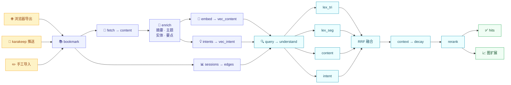

<p align="center">
  
</p>

<h1 align="center">🔖 facetmark</h1>

<h3 align="center">记得内容，想不起标题？照样找回来 —— 用记忆搜索，不只匹配标题。</h3>

<p align="center">
  语义 · 原词 · 保存上下文，在你的本地 SQLite 书签库里共同参与检索。
</p>

<p align="center">
  <a href="README.md">English</a> · <b>简体中文</b> ·
  <a href="#-快速开始"><b>🚀 快速开始</b></a> ·
  <a href="#-安装"><b>📦 安装</b></a> ·
  <a href="#-配置"><b>🔧 配置</b></a> ·
  <a href="#-实测到了什么"><b>📊 实测结果</b></a> ·
  <a href="#-拿它当-karakeep-的搜索引擎"><b>🔗 karakeep</b></a> ·
  <a href="#-参与贡献"><b>🤝 参与贡献</b></a>
</p>

<p align="center">
  <a href="https://github.com/88lin/facetmark/actions/workflows/ci.yml"></a>
  <a href="https://pypi.org/project/facetmark/"></a>
  <br>
  <a href="https://www.python.org/"></a>
  <a href="LICENSE"></a>
  <a href="tests/"></a>
</p>

> [!NOTE]
> 全部在本机运行，全部落在一个 SQLite 文件里。不上传、不删除，也**从不写回**你浏览器
> 自己的书签库。

---

## 🎯 它要解决的问题

八个月前你存了一个页面。你记得**为什么**存它——「有人在某个帖子里贴的那篇讲
Postgres 索引类型的东西」——你也大概记得是什么时候。你唯独不记得它的标题，而标题
是你浏览器的书签搜索唯一会看的东西。

所以 facetmark 给每条书签建**四套不同的索引**：

| 面 | 是什么 | 回答什么样的问题 |
|---|---|---|
| **词面** 🔤 | 两个 FTS5 索引：字符三元组 + 词段 | 精确字符串、ID、代码、不带空格的中文 |
| **内容面** 📝 | 页面正文抽取后的嵌入 | 「那篇讲消费者组再平衡的文章」 |
| **意图面** 💭 | 模型生成的、你**可能**会用的查询，再用「能不能把这页捞回来」过滤一遍 | 「Kafka 怎么才能不卡住？」 |
| **上下文面** 🗂️ | 保存会话聚类、域名、图结构 | 「我调那次故障的时候顺手存的那一批」 |

……用 RRF 融合起来，然后——这才是不常见的部分——**逐个测量这四个面到底值不值得
加**，把数字公开，把输了的那些关掉。有好几个输了。[📊 实测到了什么](#-实测到了什么)
那一节就是这份诚实的清单。

---

## ⚙️ 它是怎么工作的



> [!NOTE]
> 每一段都是**幂等**的、带**指纹**的：`facetmark index` 只重跑变过的部分。富集的
> 指纹是正文哈希；嵌入的指纹是**重建出来的嵌入文本**，所以「向量存在但是拿旧文本建的」
> 这种情况也能被认出来。

---

## 🚀 快速开始

```bash
pip install facetmark            # 或者：uv pip install facetmark

facetmark init                                  # 建库
facetmark import bookmarks.html                 # Chrome/Firefox/Edge/Safari 的导出文件
facetmark index                                 # fetch → enrich → embed → sessions → edges
facetmark search "那个讲 Postgres 索引类型的"     # 也可以直接用网页界面
facetmark serve                                 # 然后打开 http://127.0.0.1:8787/app
```

<details>
<summary>📤 各浏览器如何导出书签</summary>

| 浏览器 | 步骤 |
|---|---|
| **Chrome / Edge** | `chrome://bookmarks` → ⋮ → 导出书签 |
| **Firefox** | 管理书签 → 导入和备份 → 导出书签为 HTML |
| **Safari** | 文件 → 导出 → 书签 |

</details>

### 🎮 不配 key、也没有书签库，先看效果

```bash
facetmark demo
```

> [!TIP]
> 用一个确定性的 mock provider 造一个小库，索引，跑几条查询。**不联网、不要 key、不花钱**
> ——这是最快看清输出长什么样、顺便验证安装是否正常的办法。

### 另外两条入口

```bash
facetmark import-json bookmarks.json    # Firefox 的 JSON 备份，或任意 {url,title,...} 列表
```

或者从 karakeep 推过来——见[🔗 拿它当 karakeep 的搜索引擎](#-拿它当-karakeep-的搜索引擎)。

---

## 📦 安装

**从 PyPI：**

```bash
pip install facetmark
```

**从源码：**

```bash
git clone https://github.com/88lin/facetmark
cd facetmark
python -m venv .venv && . .venv/bin/activate
pip install -e ".[dev]"
pytest -q               # 1,619 条测试，约 50 秒
ruff check src tests scripts
```

**用 Docker**（部署方式移植自 hister）：

```bash
docker compose up -d        # 构建镜像，只绑 127.0.0.1:8787
```

容器以非 root 用户运行，只有一个可写卷（`/data`，你的 SQLite 文件），带 `/health`
健康检查，端口映射的宿主侧钉在回环地址——把你的阅读史索引发到局域网是你要故意
改一行才能发生的事，不是默认。详见 `compose.yml`。

> [!NOTE]
> 需要 **Python 3.10+**。唯一一个重的可选依赖是 `sentence-transformers`，只有本地嵌入
> 后端才用得到。

---

## 🤖 模型接入

facetmark 对接**任何 OpenAI 协议兼容的端点**。要两样东西：一个**对话模型**（做富集
和意图生成）和一个**嵌入模型**。

```bash
export FACETMARK_API_KEY=sk-...
export FACETMARK_BASE_URL=https://api.openai.com/v1     # 必须带 /v1
export FACETMARK_CHAT_MODEL=gpt-4o-mini
export FACETMARK_EMBED_MODEL=text-embedding-3-small
export FACETMARK_EMBED_DIM=1536
```

> [!TIP]
> Azure OpenAI、together.ai、DeepSeek、硅基流动、Ollama（`http://localhost:11434/v1`）、
> vLLM、LM Studio、公司内网网关，都是同一套配置。

### 本地嵌入

有些网关只代理对话、不代理嵌入。那就把嵌入这一半换成本地模型，对话那一半留在端点上：

```bash
pip install "facetmark[local]"
export FACETMARK_EMBED_BACKEND=local
export FACETMARK_EMBED_MODEL=bge-m3
export FACETMARK_EMBED_DIM=1024
export FACETMARK_LOCAL_EMBED_PATH=/path/to/bge-m3     # 不设就联网下载
export FACETMARK_LOCAL_EMBED_MAX_SEQ=1024
```

`facetmark selfcheck-embed` 在你花一小时索引之前先验一遍后端：拿一组固定的 64 篇探针
各嵌两次，报告自余弦和最佳错配余弦。bge-m3 在 1024 token 下实测最小自余弦
**0.999976**，64/64 全部自我匹配；把预算压到 512 token，最小自余弦掉到 0.9769——这就是
默认值取 1024、以及为什么要有这条自检的原因。

> [!WARNING]
> **改 `FACETMARK_EMBED_DIM` 会让所有已存的向量作废。** facetmark 宁可拒绝混维也不肯
> 悄悄返回胡说八道；改完请带 `--force` 重建。

---

## 🔧 配置

所有配置项都可以是 `FACETMARK_` 前缀的环境变量、工作目录下 `.env` 里的一行，或者
`<DATA_DIR>/config.toml` 里的一个键。这也是优先级顺序，从高到低——网页 UI 写下的文件
永远压不过你手动导出的环境变量。网页 UI 的「设置」面板改的就是这个文件，
`facetmark config path` 会打印它在哪。

`DATA_DIR` 按系统取默认值：Windows 是 `%LOCALAPPDATA%\facetmark`，设了
`XDG_DATA_HOME` 就是 `$XDG_DATA_HOME/facetmark`，否则 `~/.local/share/facetmark`。

| 变量 | 默认值 | 作用 |
|---|---|---|
| `DATA_DIR` | 见上，按系统 | 数据库和缓存放哪 |
| `DB_NAME` | `facetmark.db` | `DATA_DIR` 里的数据库文件名 |
| `API_KEY` | — | OpenAI 协议端点的 key |
| `BASE_URL` | `https://api.openai.com/v1` | 端点根地址，**必须**带 `/v1` |
| `CHAT_MODEL` | `gpt-4o-mini` | 富集和意图生成 |
| `EMBED_MODEL` | `text-embedding-3-small` | 嵌入 |
| `EMBED_DIM` | `1536` | 向量维度，改了就作废整个向量库 |
| `EMBED_BACKEND` | `endpoint` | `endpoint` 或 `local` |
| `LOCAL_EMBED_PATH` | — | 本地 sentence-transformers 模型路径 |
| `LOCAL_EMBED_MAX_SEQ` | `1024` | 每篇的 token 预算 |
| `LOCAL_EMBED_BATCH` | `8` | 本地批大小 |
| `REQUEST_TIMEOUT` | `60.0` | 单次请求超时（秒） |
| `FETCH_CONCURRENCY` | `30` | 抓取并发 |
| `MIN_BODY_CHARS` | `200` | 低于这个字数就算「没有正文」 |
| `BODY_TRUNCATE_CHARS` | `6000` | 送去富集的正文长度 |
| `ENRICH_CONCURRENCY` | `4` | 富集并发 |
| `INTENT_GENERATE_N` | `8` | 每页生成多少条候选意图 |
| `INTENT_KEEP_N` | `4` | 过滤后留几条 |
| `RRF_K` | `60` | RRF 常数 |
| `CANDIDATES_PER_FACET` | `50` | 每个面的候选深度——是**下界**，见[分页](#-分页) |
| `MAX_PAGE_SIZE` | `200` | 任何接口单页最多给多少条；要多了是截断，不是报错 |
| `MAX_CANDIDATE_DEPTH` | `2000` | 候选深度的硬上限，免得一次深翻页变成无界查询 |
| `RERANK_DEPTH` | `20` | 交叉编码器实际重排多少条 |
| `GRAPH_EXPAND_HOPS` | `1` | 扩展半径 |
| `GRAPH_EXPAND_FACTOR` | `0.6` | 跨一条边带走多少分 |
| `DECAY_FACTOR` | `0.5` | 冷层结果乘的系数 |
| `DECAY_AGE_DAYS` | `365` | 冷层的年龄条件 |
| `DECAY_RESCUE_THRESHOLD` | `0.02` | 低于这个分就撤销降权——**注意**[实测到了什么](#-实测到了什么)里关于它的那条 |
| `HOST` / `PORT` | `127.0.0.1` / `8787` | 服务监听地址 |

---

## 📋 命令

| 命令 | 做什么 |
|---|---|
| `facetmark init` | 建库 |
| `facetmark import FILE.html` | 导入浏览器书签导出文件 |
| `facetmark import-json FILE.json` | 导入 Firefox JSON 或通用列表 |
| `facetmark index` | 跑完整流水线，跳过没变的部分 |
| `facetmark fetch` / `enrich` / `embed` / `intents` / `sessions` / `edges` | 单跑某一段 |
| `facetmark search QUERY` | 命令行检索（支持查询语言） |
| `facetmark crawl URL` | 礼貌地爬一个站点入库 |
| `facetmark serve` | Web 界面 + REST API |
| `facetmark health` | 复检已存 URL，记录 `gone` / `drifted` 判定 |
| `facetmark stats` | 各表行数、各阶段覆盖率 |
| `facetmark demo` | 合成库 + mock provider，不联网 |
| `facetmark selfcheck-embed` | 索引之前先验嵌入后端 |
| `facetmark eval` | 拿一份查询集跑一个或多个档位 |
| `facetmark update` | 查看 PyPI 上有没有新版本 |
| `facetmark export` | 把库导回 JSON |

> [!TIP]
> 任何一段加 `--force` 都可以无视指纹重做。

---

## 🔤 查询语言

所有检索入口——网页输入框、CLI、API、MCP 工具、karakeep 插件——都接受字段过滤、
否定、短语、多选、通配符、日期范围和排序指令，**移植自
[hister](https://github.com/asciimoo/hister)**（searx 作者的私有搜索引擎）。
完整指南见 [`docs/query-language.md`](docs/query-language.md)：

```bash
facetmark search "postgres domain:github.com -title:tutorial"
facetmark search "kafka added:<7d"                     # 这周存的
facetmark search "title:加密 (signal|matrix)"           # 标题匹配，任一站点
facetmark search "domain:github.com sort:date"          # 浏览式，最新在前
facetmark crawl https://docs.sqlite.org/ --max-pages 25 # 然后跑 index
```

兼容规则是重点：**不带语法的查询和语言存在之前的行为完全一致**——解析器只把
「不可能是纯文本」的 token 当语法（`note:` 不是字段；词内的连字符不是否定）。
过滤器在融合之后裁切候选池，从不改动幸存页面的分数，默认排序没有为这个功能
让过路。

Web 界面在另外三处说同一门语言：联想列表会补全字段名**以及你库里真实存在的值**，
搜索框下方的 chips 会写入 `added:` token，库视图的保存时间线（`/timeline`）把
你的保存按天/月分桶——每个桶就是你本可以手敲的一次搜索。

**你自己的标签也在这门语言里。** Netscape 与 pinboard 导出自第一版导入器起就带着
`TAGS` 属性，一直被解析出来又在入库前丢掉；现在它存在 bookmark 上、随每条命中返回、
并且可以用 `tag:work` 查询——精确匹配数组里的一个元素，所以 `tag:work` 不会悄悄扩成
`workshop`。`POST /bookmark` 和 MCP 的 `save_bookmark` 工具同样接受 `tags`。

---

## 🔍 检索档位

`facetmark search --config NAME`，以及检索 API 的 `config` 字段，都吃这些名字。它们
存在是因为**每一个都曾经是一条被测量过的假设**。

| 名字 | 面 | 额外层 | 备注 |
|---|---|---|---|
| `A` | content | — | **W1 查询集上的赢家** |
| `B` | content, lex_seg, lex_tri | — | 加词面反而输了 5.4 pp |
| `C` | 四个面 | — | |
| `D` | 四个面 | context, graph | |
| `E` | 四个面 | context, graph, rerank | |
| `full` | content | graph, decay | 配了 key 时的出厂默认 |
| `fused` | 四个面 | context, graph, rerank, decay | mock provider 下的出厂默认 |

另外还有约二十个探索档（`A_ctx`、`A_gatedctx`、`C_notri`、`C_lowlex`、`C_abstain`、
`C_max`、`D_gated`、`lex_only`、`seg_only`、`tri_only` 等等）供下面这些实验使用。
`facetmark eval --list-configs` 会全部列出来。

---

## 📄 分页

每个检索接口都收 `limit`、`offset`、`depth`，每个检索响应都会报告它实际给出的那个窗口：

```jsonc
{
  "hits": [ /* ... */ ],
  "limit": 20,          // 实际给出的（截断之后），不是把请求原样回显
  "offset": 20,
  "depth": 60,          // 这一版排名是在多深的候选池上算出来的
  "total": 137,         // 参与排名的文档数；depth_capped 为真时它是个下界
  "has_more": true,
  "depth_capped": false // 停下来是因为撞了深度上限，不是因为库到底了
}
```

```bash
facetmark search "kafka rebalance" -n 20                    # 第一页
facetmark search "kafka rebalance" -n 20 -o 20 --depth 60   # 下一页
```

只要还有下一页，CLI 会把下一页该带的 `--offset` / `--depth` 直接打出来。

<details>
<summary>📖 为什么 <code>depth</code> 是个参数，而不是一个实现细节</summary>

以前页大小和检索深度是同一个数：要更多行，就悄悄检索得更深；而且不管页大小怎么调，
第 51 条都够不着，因为候选池本来就只有 50 行。现在页是一个窗口，窗口底下那个池子有多
大，你看得见，也钉得住。

钉得住这件事有必要，是因为 **RRF 只在单面时对「池子变深」保持名次稳定**。一篇文档的
分数是它在**所询问深度之内**被哪些面排到过的求和，所以池子变深会凭空给某篇文档补上一
项——而这一项可以比对手的全部分数还重。一个面第 2 名加另一个面第 40 名，赢过单面第 1
名（1/62 + 1/100 对 1/61），但在深度 30 时后一项根本不存在。于是多个面同时在场时，靠
加深池子去够第二页，会让第二页对第一页的内容改口。

解法不是把它加深，而是把上一页响应里的 `depth` 原样送回来，这样每一页都是同一版排名
上的一刀。不传就按窗口推导——绝大多数请求只要一页，这条路更便宜。

出厂的 `full` 档只有一个面，所以钉不钉都精确。`fused`（mock provider 下的默认）有
四个面，不钉就不精确。

</details>

<details>
<summary>⚙️ 上限与行为变更</summary>

**上限。** `MAX_PAGE_SIZE` 限一页，`MAX_CANDIDATE_DEPTH` 限池子。两个都是截断而不是
拒绝：一个要 10,000 行的调用方想要的是结果，不是一个 422——而响应会告诉它实际拿到了
多少，它自己就知道该在哪停。池子是被上限切断的、而不是库真的到底了，`depth_capped`
会说出来；这正是「点下一页」和「换个更窄的查询」的分界。

`CANDIDATES_PER_FACET` 现在是下界而不是池子大小：每次检索至少取这么深，所以哪怕只要
5 行，`total` 也是个诚实的数。

**关于相关性，什么变了、什么没变。** 同一个深度上，融合排出来的名次和以前一模一样
——没有动任何权重、任何常数、任何默认档位。变的是深度本身：它现在可见、可寻址，而且
不再是页大小的副作用。

有两处行为确实动了，都是有意的：

- **重排**现在受 `RERANK_DEPTH`（20）约束。这本来就是 `rerank.DEFAULT_DEPTH` 写着的值，
  只是流水线一直用「有多少条就重排多少条」把它盖掉了。LLM 重排是 listwise 的——一次
  chat 调用，prompt 里每个候选一行，输出里每个候选一个分数——所以页越大，输入和输出
  同时变长，超过某个页大小之后连「每个 id 都要有分数」这个约定都装不进上下文窗口。在
  会重排的档位（`E`、`fused`）上，超过 20 条的那一页，尾巴保持融合顺序。
- **首屏**（`quick_search`）的深度现在至少是 `CANDIDATES_PER_FACET`，而不是
  `3 × limit`，于是小的第一页和大的第一页是从同一个池子里取的，不是从一个更浅的池子里
  取的。

这两处都**没有**做过检索质量上的测量，这里也不声称它们更好。

</details>

---

## 📊 实测到了什么

> [!IMPORTANT]
> 这一节大部分是**负面结果**。这是故意的：公开数字的意义就在于它约束了这个项目
> **能声称什么**。

### 📉 融合输了 —— 而且输给了阶梯上最简单的那一档

479 条查询，跑在一个 1,700 条书签的真实库上（[`docs/eval-w1.md`](docs/eval-w1.md)）：

| 档位 | Recall@5 | Recall@1 | MRR@10 | p50 延迟 |
|---|---|---|---|---|
| **A** — 只有内容向量 | **0.643** | **0.505** | **0.564** | **148 ms** |
| B — ＋两个词面 | 0.589 | | | 189 ms |
| C — 四个面全上 | 0.635 | | | 526 ms |
| D — ＋上下文＋图 | 0.639 | | | 523 ms |

三条预注册判据**全部未通过**。加面没有帮助，代价是 **5.4 pp** 和 **3.5 倍延迟**。分
查询类型看 A 档：内容型 0.959、模糊型 0.706、情景型 0.279——情景型这个数字，恰恰是
意图面和上下文面本来要修的。

有两样东西活下来了：

- **图扩展**作为**单独一组**结果：**+2.09 pp**，10 胜 0 负，p=0.0019，代价 9 ms。
- **重排**在 Recall@1 上的收益：**+4.80 pp**，CI95 [+1.46, +8.35]，45 胜 22 负，
  p=0.0067。

### 🚪 上下文乘子：一个 flag，两次改默认

在一份全新的 616 条留出集上（[`docs/gate-w2w3.md`](docs/gate-w2w3.md)），把上下文乘子
门控在「查询里有明确时间表达」这个条件上，看起来是唯一一个干净的胜利：
`A → A_gatedctx` = **+3.09 pp** [1.79, 4.55]，19 胜 0 负，p=3.8e-6。于是它上线了。

然后，一份专门为了**触发**这个门而构造的 361 条探针集
（[`docs/gate-precision.md`](docs/gate-precision.md)）测了它**触发时**会发生什么：

| | Recall@5 | Recall@1 |
|---|---|---|
| A | 0.9058 | 0.801 |
| A_gatedctx | 0.7175 | 0.363 |

**−18.83 pp**，CI95 [−23.27, −14.68]，3 胜 71 负。分层看：推断出的时间窗**不含**目标
时（n=304）代价 −22.37 pp；含目标时（n=57）收益恰好 **+0.00 pp**。这个门从来不帮忙，
还经常造成破坏。判定 `gate_precision_unqualified`，默认值回退到不门控。

`gate_v2` 起过草，然后被拒绝：它在同一份探针集上仍然是 −10.52 pp，尽管它在 616 条集
上是 +1.79 pp。同一个机制、两次尝试、证据方向一致——第三次尝试是**主动放弃**，而不是
调到通过为止。

### 🔬 另外五个候选修复，也都测了

| 修复 | 结果 | 链接 |
|---|---|---|
| **词面审计** | 内容型查询里 80.1%、模糊型里 46.3% 根本不需要向量。但有 **6.05%**（479 条里的 29 条）**只有**词面能找到，超过预注册的 5% 线，所以词面即使在融合里输了也留在箱子里。 | — |
| **融合解剖** | 原因是平权 RRF：两个弱面上的巧合（0.0279）能压过一个强面上的确信（0.0164）。这是算术，不是调参。 | [`docs/w2-fusion-anatomy.md`](docs/w2-fusion-anatomy.md) |
| **三元组在中文上** | 211 条中文查询里只有 25 条（11.85%）拿得到三元组候选。修好之后是 202/211（95.73%）。整体 Recall@5：**一动不动**。一个面可以坏掉、被修好、然后依然无关紧要。 | — |
| **位移力介质** | 上下文乘子的 `MAX_BOOST = 1.60` 在 A 档跨过分数动态范围的 79.7%，在 C/D 档只有 20.9%；要有同等位移力，上限得是 6.03。66.3% 的候选拿到的乘子恰好等于 1.0。 | [`docs/w3-criterion-medium.md`](docs/w3-criterion-medium.md) |
| **意图面** | 人工判读 50 条生成的意图：19/50 = 38% 是真人可能会打出来的查询，低于 50% 的线。而且**信息词在页面上完全不出现**的比例整体 34.0%，在正文贫瘠的页面上升到 **62.4%**——而正文贫瘠正是这个面本来要服务的那批页面。 | [`docs/w4-intent-strata.md`](docs/w4-intent-strata.md) |

意图面的代码没删；被否掉的是「把它当作一个平权检索面」这个用法。

### 🔄 karakeep 往返实验：`roundtrip_unfaithful`

2,376 条真实书签推进一个 karakeep 形态的库再拉回来，616 条留出查询，协议在数据搬动
之前就冻结了（[`docs/karakeep-roundtrip-protocol.md`](docs/karakeep-roundtrip-protocol.md)，
完整结果见 [`docs/karakeep-roundtrip.md`](docs/karakeep-roundtrip.md)）。

| | 判据 | 实测 | |
|---|---|---|---|
| a | \|ΔRecall@5\| ≤ 3 pp，CI95 落在 ±5 pp 内 | **−0.81 pp**，CI95 [−2.44, +0.81] | ✅ 通过 |
| b | overlap@5 中位数 ≥ 4 **且** top-1 一致率 ≥ 80% | 中位数 4.0；top-1 **79.06%** | ❌ **未通过** |
| c | HTTP 与原生读取路径逐条一致，616 × 2 档 | 0 处不一致 | ✅ 通过 |

**判据 b 差 0.94 pp 未通过**，而原因已经归因到底。正文逐字节保真（1876/1876）。摘要逐
字保真（2375/2375，100%）。但 `topics` 一致率 **0%**、`entities` 只有 1.18%——因为
karakeep 的 tag 是浏览器的**文件夹**标签，那描述的是一个书架，不是一个页面。嵌入文本
里那行关键词从 **19,016 个不同词塌缩到 13 个**，人均 10.32 → 0.76，最高频的词是
`未分类`，出现在 1,124 页上。向量随之漂移，中位余弦 0.9846——足以打乱榜首，又不足以
改变总体召回。

把源库的富集移植回去之后，**2376/2376** 条嵌入文本逐字符相同，残差 0，所以归因是完全
的。在桥接库上跑一次 `facetmark index` 就能修好：karakeep 给过的正文 0 条被重抓，
2376/2376 条桥接写入的行被重新富集拾起，重建出来的图与源库完全一致，只差 212 条语义边
（26,485 对 26,697）——正是那些由漂移向量建出来的边。

> [!NOTE]
> **对读这个仓库里数字的人意味着什么：** 指标级的结论可以搬到 karakeep 富集的库上；
> 名次级的结论不行，除非那个库先用 facetmark 自己的富集重新索引过一遍。

### ❄️ 衰减层在默认档里够不着 —— 而这个「缺陷」其实在帮忙

这是解释往返结果时顺带发现的。RRF 的分数是 `sum_f w_f / (k + rank_f)`；`rrf_k = 60`
时单个单位权重的面最高只能给到 `1/61 = 0.016393`。而 `decay_rescue_threshold` 出厂值
是 `0.02`。默认档 `full` 恰好是**单面**配置，于是 `hot_top_score < rescue_threshold`
**恒成立**，救援阀每次都开，它守着的降权一次也没执行过。`fused` 不受影响（两个面就有
0.0279）。`tests/test_decay_reach.py` 把现状钉住了。

这是一个关于算术的证明，它不说后果。后果**量了两次，第二次把第一次推翻了**。

<details>
<summary>🔬 第一次 —— 测了一台从来没开机的仪器</summary>

**第一次**（[`docs/decay-reach.md`](docs/decay-reach.md)）：ΔRecall@5 是精确的
`0.0000 pp`，CI95 `[0, 0]`，全库 2,376 页里冷层只有 8 页、230 个目标里 0 个是冷页，于是
记成「这个缺陷的代价是零」。

**第一次测的是一台从来没有开机的仪器。** 它自己的 §7 承认「健康检查的覆盖率没有量」。
后来量了：那个库的 `health` 表有**零行**——健康检查器从来没跑过，冷层条件 3 里靠健康
判定的那一半从来没有可能触发。另外 `open_count` 对全部 2,376 条都是 0（浏览器书签导出
不带使用遥测），条件 1 也是恒真的。实际在工作的只有条件 2 加 supersession 边，那 8 页
就是这么来的。

</details>

<details>
<summary>🔬 第二次 —— 真正的测量，推翻了第一次</summary>

**第二次**（[`docs/decay-instrumented.md`](docs/decay-instrumented.md)）：同一份字节上跑
一遍本地健康检查（`save_recovered=False`，所以只有 `health` 表变了——`content`、
`edge`、`bookmark` 三张表的深度指纹和向量、FTS 全部逐位一致），重做完全相同的 A/B：

| | shipped `0.02` | reachable `0.0` |
|---|---|---|
| Recall@5 | **0.5860** | **0.5714** |
| Recall@1 | 0.4237 | 0.4188 |
| 救援阀打开的查询数 | 417 / 616 | 0 / 616 |

| | 第一次 | 第二次 |
|---|---|---|
| `health` 表行数 | 0 | 2,376 |
| 冷层页数 | 8（0.34%） | **73（3.07%）** |
| 冷层 ∩ 230 个目标 | **0** | **8**（19 条查询） |
| ΔRecall@5 | `+0.0000 pp` `[0, 0]` | **`−1.4610 pp`** `[−2.5974, −0.4870]` |

**修那个阈值要付 1.46 pp 的 Recall@5**，区间不含零。机制能逐条数出来，不需要统计：37
条目标名次变化里，**12 条跌出 20 名列表——其中 10 条原本在前 5、5 条原本排第 1**；24
条上升（21 条只升一名），而只有 **1** 条因此跨进前 5。净 `−10 + 1 = −9`，`−9/616` 正是
`−1.4610 pp`。收益全落在 Recall 桶内的位移，损失全落在桶边界上。

</details>

> [!CAUTION]
> **根因：条件 3 把「URL 死了」当成了「存下来的副本没用了」。** facetmark 存正文，一个
> 404 页面上的那段文字仍然是问题的正确答案。`drifted` 更反——它的意思是远端和本地快照
> 对不上，而这恰恰说明本地这份是唯一还留着原内容的地方。
>
> 所以阈值仍然不动，但理由和第一次相反了：不是「收益是零」，而是**「一个 bug 正在抵消
> 另一个 bug，而这个抵消是承重的」**。窄化条件 3 需要**一批新的查询集**——两个显然的
> 候选改法都是看了这 616 条的失败案例之后想出来的，在同一批上评分等于报训练集分数。而
> 且两个都不干净：8 个受损目标里 4 个的 `char_count = 0`，完全没有正文，却仍然被检索
> 到、仍然是正确答案，靠的是标题和两个词面面。

`cold_census()` 现在把三个条件分开报，并在 `fm stats` 与 `fm health --check` 里给两处
静默失效起了名字（`never_opened_selects_everything`、`health_never_checked`），好让
下一个这样的缺口不必靠手动去查才能发现。

### ✅ 一次真实导出上的跑通

`favorites_2026_8_4.html`，1.7 MB，96 个文件夹，最深 4 层：解析 1,710 → 入库 1,701，
合并重复 9 条，不可索引 1 条。在不抓正文的情况下索引：322 个会话、9,132 条边、1,386
个域名、1,775 条向量。那台机器上查询中位延迟 2,265 ms。细节见
[`docs/real-library-demo.md`](docs/real-library-demo.md)。

---

## 🔗 拿它当 karakeep 的搜索引擎

[karakeep](https://github.com/karakeep-app/karakeep) 是一个自托管的书签管理器，带一个
搜索提供方插件接口。facetmark 实现了这个接口，于是存储、同步、界面继续归 karakeep，
facetmark 只负责回答查询。

```bash
cp -r integrations/karakeep/search-facetmark \
      /path/to/karakeep/packages/plugins/search-facetmark
# 在 packages/plugins/package.json 的 exports 里加一行：
#   "./search-facetmark": "./search-facetmark/index.ts"
# 在 packages/shared-server/src/plugins.ts 的 loadAllPlugins() 里加一行：
#   await import("@karakeep/plugins/search-facetmark");
#   位置必须在 meilisearch 那行之后——PluginManager 交出的是最后注册的那个
export FACETMARK_URL=http://127.0.0.1:8787
export FACETMARK_TOKEN=...
```

然后 `facetmark serve`，karakeep 的搜索框就是 facetmark 了。

> [!NOTE]
> 这个插件每次 push 都会对着 karakeep 的**真实接口**做类型检查：上游的
> `packages/shared/search.ts` 和 `packages/shared/plugins.ts` 按 blob SHA 钉在
> `integrations/karakeep/typecheck/upstream-pins.json` 里，CI 拿它们跑 `tsc --noEmit`。
>
> 字节也钉住了。`integrations/karakeep/contract/` 用 karakeep 驱动插件的方式驱动真插件，
> 把 `fetch` 换成记录器，请求体落进 `wire.json`；`tests/test_karakeep_contract.py` 把这些
> 请求体**原样重放**进真实的 FastAPI 应用，再把响应写回去给捕获脚本解析。**每一边断言
> 的都是另一边产出的文件**，所以插件多发一个 Python 模型不认识的字段，是一个测试失败而
> 不是一份 bug 报告。它抓到的一件值得复述的事：请求「唯一一条匹配结果的 offset 1」时，
> 响应是 `hits: []` 但 `totalHits: 1`——**空的 `hits` 不等于没搜到**。仍然没有测的是一个
> 真正跑起来的 karakeep 实例：格式契约不是集成测试。

> [!IMPORTANT]
> 依赖这条路之前请先读 [`docs/karakeep.md`](docs/karakeep.md)：里面写了字段映射、哪些
> 东西不保真，以及富集的归属规则——桥接是**认领**一行富集，它从不覆盖真实模型写下的那
> 一行。

---

## 🗄️ 数据模型

一个 SQLite 文件。你比较可能直接查的那些表：

| 表 | 存什么 |
|---|---|
| `bookmark` | url、title、folder、date_added、open_count、source |
| `content` | body_text、body_hash、char_count、lang、extractor、http_status |
| `enrichment` | summary、topics、entities、key_points、model、source_hash |
| `intent` | 生成的查询、是否保留、回捞检查里的名次 |
| `vec_content` / `vec_intent` | 嵌入，按书签索引 |
| `fts_tri` / `fts_seg` | 覆盖 title / body / summary / extra 的 FTS5 索引 |
| `session` / `bookmark_session` | 保存爆发聚出来的会话及其成员 |
| `edge` | `(src, dst, kind, weight)`；kind 有 session、semantic、same_domain、supersession |
| `health` | 每个 URL 历次判定：ok、gone、drifted、soft_gone |
| `karakeep_doc` | 按需创建；卸载桥接就是把它 drop 掉 |

> [!NOTE]
> `enrichment.source_hash` 是决定一页要不要重新富集的指纹。值 `'karakeep'` 是保留值，
> 意思是「这行属于桥接，可以随便覆盖」；其他任何值都意味着是真实模型写的，桥接必须放手。

---

## 🛠️ 排错

| 症状 | 原因与修法 |
|---|---|
| `Dimension mismatch: expected 1024, received 1536` | 库里的向量和 `FACETMARK_EMBED_DIM` 对不上。要么把维度改回去，要么带 `--force` 重新嵌入。 |
| `base_url` 报错 / 每个调用都 404 | 地址必须以 `/v1` 结尾。只给 `https://host/` 的网关会在 `/chat/completions` 上 404。 |
| 富集悄无声息什么都没干 | `enrich.targets()` 在 `source_hash` 已经等于正文哈希时会跳过这一行。用 `facetmark enrich --force`。 |
| 某一页有向量但结果很差 | 就是上面说的那种失效模式。`facetmark embed --force` 会按当前文本重建。 |
| 打开数据库报 `disk I/O error` | SQLite 在某些网络盘和 FUSE 文件系统上跑不了。先把文件拷到本地盘。 |
| 抓取被挡 | facetmark 是**故意**遵守 `robots.txt` 和分域名限速的。调低 `FETCH_CONCURRENCY`，或者接受有些页面就是没有正文；流水线对没有正文的页面会回落到只用标题的指纹，不会卡住。 |

---

## ❓ 常见问题

<details>
<summary><b>它会上传我的书签吗？</b></summary>

**不会。** 全部网络流量只有两处：抓页面，和你自己配的模型端点。如果
`EMBED_BACKEND=local` 且不配 `API_KEY`，除了抓页面之外一点网络都不走。

</details>

<details>
<summary><b>它会改我浏览器里的书签吗？</b></summary>

**永远不会。** 导入是单向只读的。

</details>

<details>
<summary><b>完全不用大模型能用吗？</b></summary>

**能**，功能会退化：词面和会话/域名图完全不需要模型。你会失去内容面和意图面。

</details>

<details>
<summary><b>索引要花多少钱？</b></summary>

主要成本在富集：大约每页一次小的对话调用。1,700 页用 `gpt-4o-mini` 是几分钱的量级。
嵌入更便宜，用本地模型就是免费。

</details>

<details>
<summary><b>为什么在我的库上这么慢？</b></summary>

几乎总是抓取。不抓正文的话 `facetmark index` 是分钟级；带抓取的话瓶颈是礼貌性限速，
不是 CPU。

</details>

<details>
<summary><b>为什么默认档只用一个面？</b></summary>

因为四面融合在 479 条真实查询上测出来**比**单独的内容面**更差**，而这个项目发布的是
数字说的话，不是架构图说的话。

</details>

---

## 🛡️ 这个项目守的边界

- **📖 对浏览器只读。** 导入从不写回。
- **🗑️ 什么都不删。** 冷层只降权，不归档、不移除。
- **💾 本地优先。** 一个 SQLite 文件，可以拷走，可以用 `sqlite3` 直接看。
- **🤝 默认礼貌。** `robots.txt`、分域名限速、真实 UA。
- **📏 没有协议就没有数字。** 这份 README 里的每一个结果都有一条在测量之前写下的预注册
  判据，而且失败结果和成功结果放在同样显眼的位置。
- **🔒 没有查询集就不改默认。** 包括上面列的两个已知缺陷。

---

## 📁 目录结构

```
facetmark/
├── src/
│   └── facetmark/
│       ├── cli.py                      # 命令行入口 (typer)
│       ├── api.py                      # FastAPI REST API
│       ├── service.py                  # 业务逻辑层
│       ├── config.py                   # 环境变量与配置
│       ├── configfile.py               # config.toml 读写
│       ├── db.py                       # SQLite 数据库层
│       ├── text.py                     # 文本处理工具
│       ├── normalize.py                # URL 归一化
│       ├── sessions.py                 # 保存会话聚类
│       ├── edges.py                    # 图边构建
│       ├── providers.py                # 模型提供方 (OpenAI 兼容)
│       ├── mcp_server.py               # MCP 服务端
│       ├── migrations.py               # 数据库迁移
│       ├── crawl.py                    # `facetmark crawl`：站点行走
│       ├── admin.py                    # 管理命令
│       ├── importers/                  # 浏览器书签解析
│       │   ├── netscape_html.py        #   HTML 格式 (Chrome/Edge/Safari/Firefox)
│       │   ├── chrome_json.py          #   Chrome JSON
│       │   ├── base.py                 #   公共基类
│       │   ├── discovery.py            #   格式自动识别
│       │   └── timestamps.py           #   时间戳解析
│       ├── fetch/                      # 礼貌抓取
│       │   ├── client.py               #   HTTP 客户端
│       │   ├── robots.py               #   robots.txt 解析与缓存
│       │   ├── extract.py              #   正文抽取 (trafilatura + readability)
│       │   └── store.py                #   抓取结果落库
│       ├── enrich/                     # 富集
│       │   ├── pipeline.py             #   富集流水线
│       │   ├── intent.py               #   意图生成与回捞过滤
│       │   ├── vectors.py              #   嵌入文本构造
│       │   ├── prompts.py              #   LLM prompt 模板
│       │   └── schema.py               #   富集结果 schema
│       ├── search/                     # 检索
│       │   ├── pipeline.py             #   检索流水线
│       │   ├── querylang.py            #   查询语言：解析器与过滤器
│       │   ├── lexical.py              #   词面 (FTS5 trigram + segment)
│       │   ├── vectors.py              #   向量检索
│       │   ├── rrf.py                  #   RRF 融合
│       │   ├── context.py              #   上下文乘子
│       │   ├── graph.py                #   图扩展
│       │   ├── decay.py                #   衰减层
│       │   ├── rerank.py               #   LLM 重排
│       │   ├── abstain.py              #   弃权
│       │   └── understand.py           #   查询理解
│       ├── health/                     # URL 健康检查
│       │   ├── verdicts.py             #   判定逻辑
│       │   ├── store.py                #   判定存储
│       │   ├── external.py             #   远端检查
│       │   ├── local.py                #   本地检查
│       │   └── synth.py                #   合成探测
│       ├── bridges/                    # karakeep 推拉桥接
│       │   └── karakeep.py
│       ├── eval/                       # 评测框架
│       │   ├── harness.py              #   评测驱动
│       │   └── corpus.py               #   语料加载
│       └── web/                        # 单页 Web UI
│           ├── index.html
│           └── static/                 # 前端资源 (JS/CSS/SVG)
├── integrations/
│   └── karakeep/                       # TypeScript 插件、上游类型钉、跨语言线格式契约
│       ├── search-facetmark/           #   插件源码
│       ├── typecheck/                  #   上游接口类型检查
│       └── contract/                   #   线格式契约测试
├── extension/                          # 浏览器扩展 (检索、保存、抓取兜底)
├── eval/                               # 查询集与评测数据 (JSON/JSONL)
├── scripts/                            # 实验驱动与探针
├── docs/                               # 一个实验一份文档，协议在前
│   └── landing/                        #   项目站点，由 build.py 生成
├── tests/                              # 1,619 条测试
├── pyproject.toml
├── LICENSE
└── README.md
```

---

## 🤝 参与贡献

欢迎 issue 和 PR。先说三件事：

> [!IMPORTANT]
> 1. **改检索质量要先有协议。** 如果一个改动会移动默认排序，请先开一个
>    `retrieval-proposal` issue，把假设、查询集、判据写在**测量之前**。模板在
>    `.github/ISSUE_TEMPLATE/` 里。
> 2. **跑 `pytest -q` 和 `ruff check src tests scripts`。** 不要跑 `ruff format`，
>    这份代码是手工排版的。
> 3. **负面结果也是贡献。** 一条测出来的「这个没用」，在这里比一条没测过的改进更值钱。

见 [CONTRIBUTING.md](CONTRIBUTING.md)、[CODE_OF_CONDUCT.md](CODE_OF_CONDUCT.md)、
[SECURITY.md](SECURITY.md)。要引用这份工作见 [CITATION.cff](CITATION.cff)。

---

## 📈 项目状态

> [!NOTE]
> 能用，而且对自己做不到的事情很诚实。检索内核、CLI、服务端、Web 界面、karakeep 桥接、
> 评测框架都能跑；上面所有数字都能从 `scripts/` 和 `eval/` 复现。

已知的未了事项，全部写出来而不是藏起来：

- **衰减层在默认档里够不着**（量过两次，第二次推翻了第一次——把健康检查真跑一遍之后，
  修这个缺陷要付 1.46 pp 的 Recall@5，所以现在是一个**承重的**意外，要真修得改冷层条件
  3 的语义，而那需要一批新查询集）。
- **意图面默认关闭**而且原因是理念性的，不是模型太小。
- **karakeep 桥接**已经钉住了上游类型和一份捕获下来的线格式契约，但仍然没有对着一个活
  的 karakeep 实例测过。
- **最大的缺口**是一份**由作者之外的人**构造的查询集。

见 [ROADMAP.md](ROADMAP.md) 和 [CHANGELOG.md](CHANGELOG.md)。

---

## 📄 License

MIT。见 [LICENSE](LICENSE)。

---

## ⭐ Star History

<picture>
  <source media="(prefers-color-scheme: dark)" srcset="https://raw.githubusercontent.com/88lin/facetmark/star-history/assets/my-star-history/star-history-dark.svg">
  
</picture>

---

<div align="center">

**如果这个项目对你有帮助，请给一个 ⭐ Star 支持一下！**

Made with ❤️ by [88lin](https://github.com/88lin)

</div>
